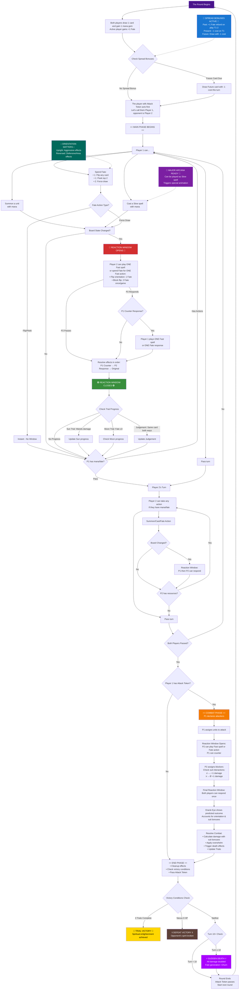

## Round flow

```mermaid
flowchart TD
    START[The Round Begins] --> DRAW_PHASE[Both players draw 1 card and gain 1 mana gem<br/>Active player gains +1 Fate]
    
    DRAW_PHASE --> SPREAD_CHECK{Check Spread Bonuses}
    SPREAD_CHECK -->|Future Card Due| FUTURE_DRAW[Draw Future card with -1 cost this turn]
    SPREAD_CHECK -->|No Spread Bonus| ATTACK_TOKEN_CHECK
    FUTURE_DRAW --> ATTACK_TOKEN_CHECK
    
    ATTACK_TOKEN_CHECK[The player with Attack Token acts first<br/>Let's call them Player 1, opponent is Player 2] --> MAIN_PHASE_START[== MAIN PHASE BEGINS ==]
    
    MAIN_PHASE_START --> P1_CAN[Player 1 can...]
    
    P1_CAN --> P1_ACTION1[Summon a unit<br/>with mana]
    P1_CAN --> P1_ACTION2[Cast a Slow spell<br/>with mana]
    P1_CAN --> P1_ACTION3[Spend Fate:<br/>• 1: Flip any card<br/>• 1: Peek top 2<br/>• 2: Force draw]
    P1_CAN --> P1_ACTION4[Pass turn]
    
    P1_ACTION1 --> P1_BOARD_CHANGE[Board State Changed?]
    P1_ACTION2 --> P1_BOARD_CHANGE
    P1_ACTION3 --> P1_FATE_CHECK{Fate Action Type?}
    
    P1_FATE_CHECK -->|Flip/Peek| P1_INSTANT[Instant - No Window]
    P1_FATE_CHECK -->|Force Draw| P1_BOARD_CHANGE
    P1_INSTANT --> P1_MORE{P1 has mana/fate?}
    
    P1_BOARD_CHANGE -->|Yes| REACTION_OPEN[🔴 REACTION WINDOW OPENS 🔴]
    P1_BOARD_CHANGE -->|No| P1_MORE
    
    REACTION_OPEN --> P2_FAST[Player 2 can play ONE Fast spell<br/>or spend Fate for ONE Fast action:<br/>• Flip orientation: 1 Fate<br/>• Block flip: 2 Fate once/game]
    
    P2_FAST -->|P2 Responds| P1_COUNTER{P1 Counter Response?}
    P2_FAST -->|P2 Passes| RESOLVE_STACK
    
    P1_COUNTER -->|Yes| P1_FAST_RESPONSE[Player 1 plays ONE Fast spell<br/>or ONE Fate response]
    P1_COUNTER -->|No| RESOLVE_STACK
    
    P1_FAST_RESPONSE --> RESOLVE_STACK[Resolve effects in order:<br/>P1 Counter → P2 Response → Original]
    
    RESOLVE_STACK --> WINDOW_CLOSE[🟢 REACTION WINDOW CLOSES 🟢]
    
    WINDOW_CLOSE --> TRIAL_CHECK{Check Trial Progress}
    TRIAL_CHECK -->|Sun Trial: Wands damage| UPDATE_SUN[Update Sun progress]
    TRIAL_CHECK -->|Moon Trial: Fate ≥3| UPDATE_MOON[Check Moon progress]
    TRIAL_CHECK -->|Judgement: Same card both ways| UPDATE_JUDGE[Update Judgement]
    TRIAL_CHECK -->|No Progress| P1_MORE
    
    UPDATE_SUN --> P1_MORE
    UPDATE_MOON --> P1_MORE
    UPDATE_JUDGE --> P1_MORE
    
    P1_MORE -->|Has Actions| P1_CAN
    P1_MORE -->|Pass| P2_TURN_START
    
    P1_ACTION4 --> P2_TURN_START[Player 2's Turn]
    
    P2_TURN_START --> P2_CAN[Player 2 can take any action<br/>If they have mana/fate]
    
    P2_CAN --> P2_ACTION1[Summon/Cast/Fate Action]
    P2_CAN --> P2_ACTION2[Pass turn]
    
    P2_ACTION1 --> P2_BOARD_CHANGE{Board Changed?}
    P2_BOARD_CHANGE -->|Yes| P2_REACTION[Reaction Window:<br/>P1 then P2 can respond]
    P2_BOARD_CHANGE -->|No| P2_MORE{P2 has resources?}
    
    P2_REACTION --> P2_MORE
    
    P2_MORE -->|Yes| P2_CAN
    P2_MORE -->|No| P2_ACTION2
    
    P2_ACTION2 --> BOTH_PASS{Both Players Passed?}
    
    BOTH_PASS -->|No| P1_CAN
    BOTH_PASS -->|Yes| COMBAT_CHECK{Player 1 has Attack Token?}
    
    COMBAT_CHECK -->|Yes| COMBAT_PHASE[== COMBAT PHASE ==<br/>P1 declares attackers]
    COMBAT_CHECK -->|No| END_PHASE
    
    COMBAT_PHASE --> DECLARE_ATTACKERS[P1 assigns units to attack]
    
    DECLARE_ATTACKERS --> COMBAT_REACTION[Reaction Window Opens:<br/>P2 can play Fast spell or Fate action<br/>P1 can counter]
    
    COMBAT_REACTION --> DECLARE_BLOCKERS[P2 assigns blockers<br/>Check suit interactions:<br/>🔥→💧 +1 damage<br/>⚔️→🪙 +1 damage]
    
    DECLARE_BLOCKERS --> BLOCK_REACTION[Final Reaction Window:<br/>Both players can respond once]
    
    BLOCK_REACTION --> ORACLE_EYE[Oracle Eye shows predicted outcome<br/>Accounts for orientation & suit bonuses]
    
    ORACLE_EYE --> RESOLVE_COMBAT[Resolve Combat:<br/>• Calculate damage with suit bonuses<br/>• Apply overwhelm<br/>• Trigger death effects<br/>• Update Trials]
    
    RESOLVE_COMBAT --> END_PHASE[== END PHASE ==<br/>• Cleanup effects<br/>• Check victory conditions<br/>• Pass Attack Token]
    
    END_PHASE --> VICTORY_CHECK{Victory Conditions Check}
    
    VICTORY_CHECK -->|3 Trials Complete| TRIAL_VICTORY[🌟 TRIAL VICTORY 🌟<br/>Spiritual enlightenment achieved]
    VICTORY_CHECK -->|Nexus 0 HP| DEFEAT_VICTORY[💀 DEFEAT VICTORY 💀<br/>Opponent's spirit broken]
    VICTORY_CHECK -->|Neither| NEXT_ROUND_CHECK{Turn 10+ Check}
    
    NEXT_ROUND_CHECK -->|Turn < 10| ROUND_END[Round Ends<br/>Attack Token passes<br/>Start next round]
    NEXT_ROUND_CHECK -->|Turn ≥ 10| SUDDEN_DEATH[⚡ SUDDEN DEATH ⚡<br/>All damage doubled<br/>Fate generation +2/turn]
    
    SUDDEN_DEATH --> ROUND_END
    
    ROUND_END --> START
    
    %% Special States
    SPREAD_BONUS[📜 SPREAD BONUSES ACTIVE 📜<br/>Past: +1 Fate refund on play T1-2<br/>Present: -1 cost on T1<br/>Future: Draw with -1 cost] -.-> SPREAD_CHECK
    
    MAJOR_READY[🔮 MAJOR ARCANA READY 🔮<br/>Can be played as Slow spell<br/>Triggers special animation] -.-> P1_ACTION2
    
    ORIENTATION_STATE[↕️ ORIENTATION MATTERS ↕️<br/>Upright: Aggressive effects<br/>Reversed: Defensive/Area effects] -.-> P1_ACTION3
    
    style START fill:#4a148c,color:#fff
    style REACTION_OPEN fill:#d32f2f,color:#fff
    style WINDOW_CLOSE fill:#388e3c,color:#fff
    style COMBAT_PHASE fill:#f57c00,color:#fff
    style TRIAL_VICTORY fill:#ffd700,color:#000
    style DEFEAT_VICTORY fill:#5d4037,color:#fff
    style SUDDEN_DEATH fill:#aa00ff,color:#fff
    style SPREAD_BONUS fill:#1976d2,color:#fff
    style MAJOR_READY fill:#7b1fa2,color:#fff
    style ORIENTATION_STATE fill:#00695c,color:#fff
```

