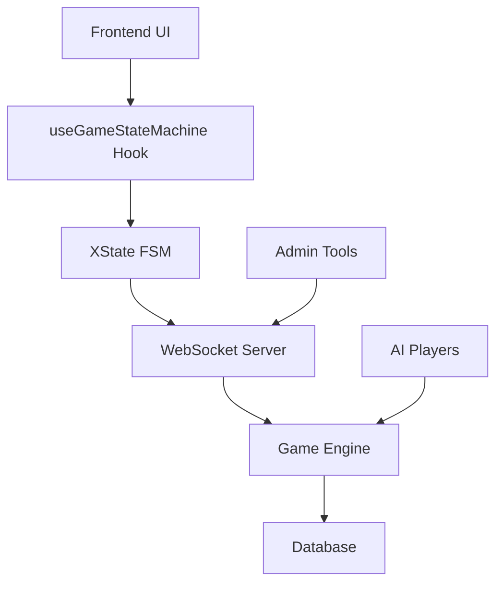

# Game Implementation Guide

This section covers the technical implementation details of the Tarot Card Game, focusing on the core game engine, state management, and integration patterns.

## Key Components

### 1. Finite State Machine (XState)
- **Location**: `packages/game-sim/src/game-flow.ts`
- **Purpose**: Manages complete game flow with proper state transitions
- **Features**:
  - Attack token system
  - Priority management
  - Spell stack with 4 speeds (Burst, Focus, Fast, Slow)
  - Combat phases with blocking

### 2. Core Game Engine
- **Location**: `packages/game-sim/src/`
- **Components**:
  - Game state management
  - Action validation
  - Effect resolution
  - Combat calculation

### 3. Frontend Integration
- **Hook**: `useGameStateMachine` for React integration
- **Components**: Game board, priority indicators, action buttons
- **State Sync**: Real-time synchronization with backend

## Architecture Overview

## Quick Links

- [Game Flow FSM](/implementation/game-flow) - Detailed state machine documentation
- [Core Mechanics](/implementation/mechanics) - Attack tokens, priority, spell speeds
- [Integration Guide](/implementation/integration) - Frontend/backend integration
- [Testing Checklist](/implementation/testing) - Comprehensive testing guide

## Development Workflow

1. **State Changes** → Update XState machine
2. **UI Updates** → Modify React components
3. **Backend Logic** → Update game engine
4. **Testing** → Run integration tests
5. **Deploy** → Update both frontend and backend

See the [Integration Guide](/implementation/integration) for detailed implementation steps.
